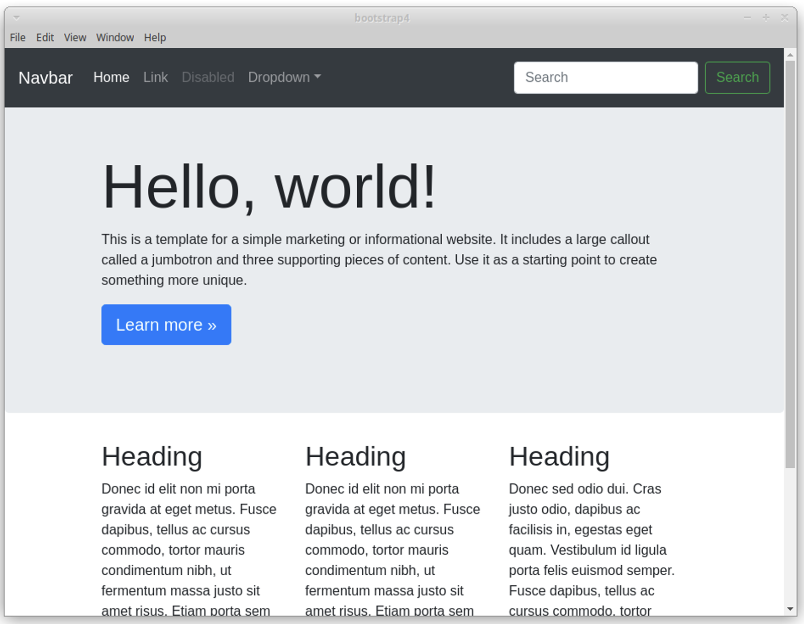

# Praktikum Bootstrap

## 📚 Description
This project is a simple responsive website built using **Bootstrap 5** as part of a university assignment for the *Web Programming* course. It demonstrates the use of layouting, components, and utilities provided by the Bootstrap framework to create a modern, clean user interface.

## 🎯 Objectives
- Implement a basic responsive web layout using Bootstrap 5
- Apply at least 15 Bootstrap components and utility classes
- Include a navbar, jumbotron, search bar, and three-column section
- Ensure mobile responsiveness and modern design practices

## 🧩 Features
- Responsive **Navbar** with dropdown and search bar
- **Jumbotron** (Hero section) with call-to-action
- Three-column **content section** with headings and text
- Custom color background with gray (`#dee2e6`) for the jumbotron
- Clean and responsive layout using Bootstrap's grid system

## 🛠️ Technologies Used
- HTML5
- Bootstrap 5 (via CDN)
- Custom CSS (minimal, optional)

## 📁 Folder Structure
```
project-folder/
├── index.html
└── README.md
```

## 🚀 Getting Started
To run the project locally:
1. Clone this repository:

   ```bash
   git clone https://github.com/yourusername/bootstrap-assignment.git
   ```
2. Open `index.html` in your web browser.

## 📸 Screenshots



## 📌 Notes
- All layouting follows the Bootstrap 5 grid and utility system
- This project fulfills the minimum requirement of using at least 15 Bootstrap components or classes

## 🔗 License
This project is for educational purposes only. Feel free to explore, learn, and improve!